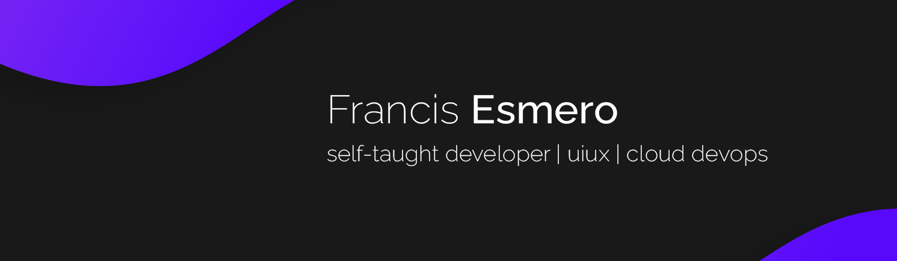

<html>
      <head>
        
      </head>
</html>

## Hello there! 👋
> #### My name is Francis Esmero and I'm a __software developer/uiux/cloud & devops enthusiast__. i'm planning to learn everything 😭  
> 
```typescript
const francis = {
    pronouns: "He" | "Him",
    myHobbies: ["Retro Bikes", "Coffee", "Photography"],
    techStacks: {
        backEnd: ["Node", "Php", "Python"],
        mobileApp: {
            hybrid: ["Ionic", 'Flutter'],
            native: ["Java"]
        },
        devOps: ["AWS", "Docker", "Kubernetes"],
        databases: ["mongo", "MySql", "dynamoDB"],
        misc: ["Firebase", "ReactJS", "Angular"]
    },
    architecture: ["Serverless Architecture", "Progressive web applications", "Single page applications", "Microservices Architecture"],
    goals: "Man, i really need to do some contributions here",
    triva: "Knowing the problem is already half of the solution"
};
```